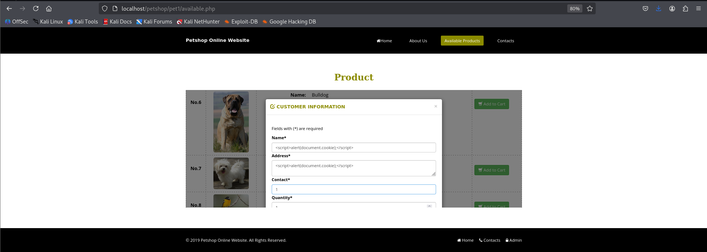
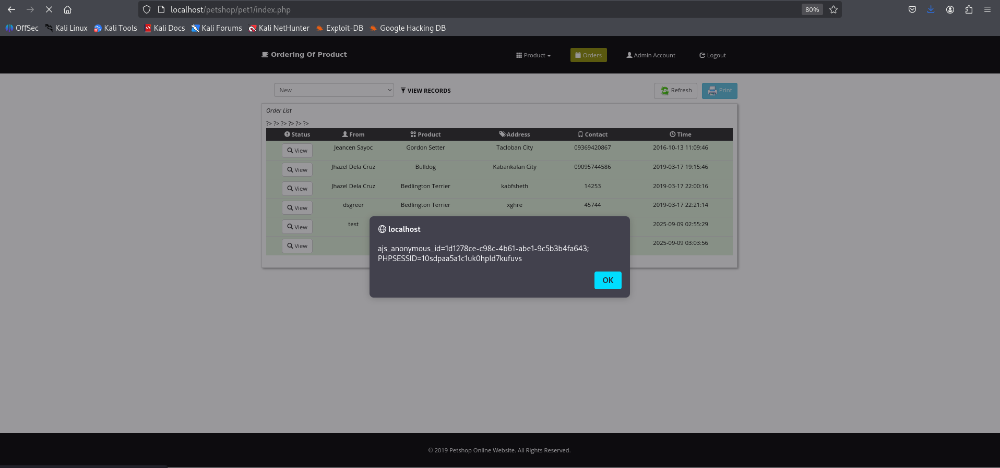
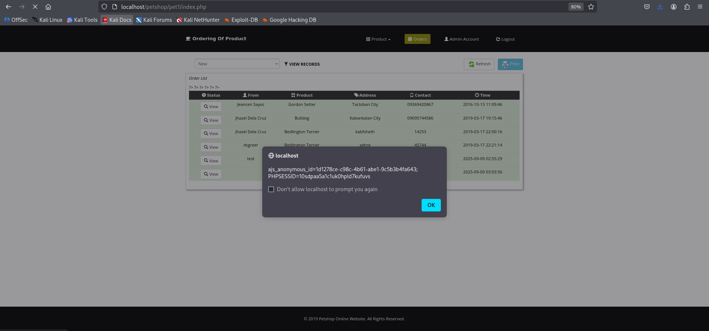

# Online Petshop Management System Stored XSS on Admin Dashboard PoC

|             | Details |
|-------------------|---------|
| **Vulnerability Type** | Stored Cross-Site Scripting (XSS) |
| **Affected File** | `availableframe.php (order processing)`, Admin Dashboard (orders) |
| **Parameter** | `name` & `address` (order form fields) |
| **Vendor** | [itsourcecode](https://itsourcecode.com/) |
| **Product** | [Online Petshop Management System v1](https://itsourcecode.com/free-projects/php-project/online-petshop-management-system/) |
| **Softlink** | https://itsourcecode.com/free-projects/php-project/online-petshop-management-system/ |

### Summary

-  The Petshop Online Website is vulnerable to Stored Cross-Site Scripting (XSS) via the order submission form. If a visitor submits an order with a malicious payload in the name or address fields, the input is stored in the database `(tblorders)` and later displayed directly on the admin dashboard without sanitization or escaping. As a result, the payload executes immediately in the admin’s browser when they view the new order. This allows an attacker to execute arbitrary JavaScript in the context of the admin user, potentially stealing cookies, performing actions on behalf of the admin, or manipulating dashboard content. The vulnerability exists because user input is stored and reflected without validation or output encoding.
  
### Vulnerable Code
Order Insertion `(availableframe.php)`.
```php
$name = $_POST['name'];
$address = $_POST['address'];

$sql = "INSERT INTO tblorders VALUES(NULL,'$name','$address','$contact','$id','$qty','new',NULL,'$otype','$datep')";
mysqli_query($con, $sql);
```
**Root Cause:** Input from the order form is stored and later rendered in the admin dashboard without escaping, enabling stored XSS.

#### Reflection Point:
-  Admin dashboard displays name and address fields directly from the database.

Any JavaScript injected in these fields executes automatically when the admin views the dashboard.
```php
$name = $_POST['name'];
$address = $_POST['address'];
$sql = "INSERT INTO tblorders VALUES(NULL,'$name','$address', ...)";
mysqli_query($con, $sql);
```
**Root Cause:** The name and address fields are inserted directly into the database and later rendered in HTML without escaping.

#### Reflection Point:
-  Admin dashboard displays `cname (name)` and `address` fields directly from the database.
-  Any JavaScript injected in these fields executes automatically when the admin views the dashboard.
---

### Proof of Concept
1.  Submit an order via `available.php` order form:
```
Name: <script>alert(document.cookie)</script>
Address: <script>alert(document.cookie)</script>
```


2.  Admin logs into their dashboard and views the new order.

3.  The payload executes immediately in the admin’s browser, confirming stored XSS.





---

#### Result:
-  The injected scripts execute in the context of the admin user without any additional action required from them.
